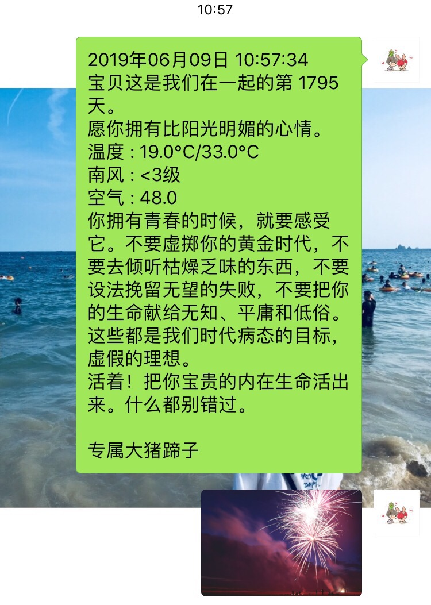
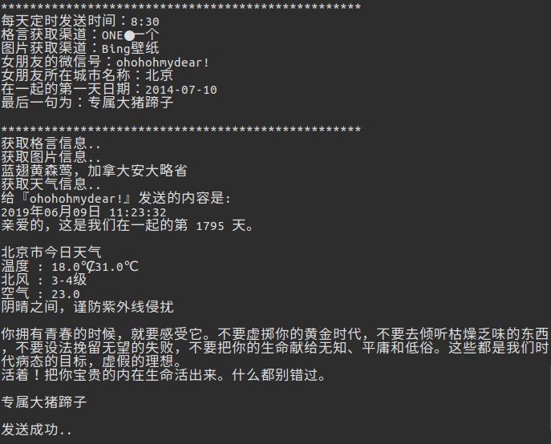

# 用 Python + itchat 写一个爬虫脚本每天定时给~~多个~~女友发给微信暖心话

## 项目介绍

开发环境：Python >= 3.6  
原项目地址：[https://github.com/sfyc23/EverydayWechat](https://github.com/sfyc23/EverydayWechat)

### （原）灵感来源

在掘金看到了一篇《[用Node+wechaty写一个爬虫脚本每天定时给女(男)朋友发微信暖心话][1]》后，我就想为什么不用 Python 去实现这个功能呢。 JUST DO IT，说做就做。  
这文章的结构也是参考上面这位朋友的。  
本来只是写单人的，不过有些优（作）秀（死）的人表示女朋友不止一个。现已支持添加多人信息。

### 项目地址

Github: [https://github.com/weiyx16/EverydayWechat](https://github.com/weiyx16/EverydayWechat)

### 使用库

- [itchat][2] - 微信个人号接口
- [requests][3] - 网络请求库
- [beautifulsoup4][4] - 解析网页
- [APScheduler][5] - 定时任务
- [pyyaml][8] - 解析yaml包
- lxml - 配合beautifulsoup4解析网页  

### 功能

维持原项目功能：定时给女朋友发送每日天气、提醒、每日一句。  
新项目增加功能：发送每日图片（顺便存图）。  

### 数据来源

#### 天气信息  

- 天气信息来自 [SOJSON][7]

#### 每日一句

- 每日一句来自 [ONE●一个][6]  
- 还可来自 [词霸（每日英语）][9]

#### 每日图片

- 每日图片同样来自 [ONE●一个][6]
- 还可来自 [Bing 壁纸][10]

### 实现效果

<div align="center">

<br> </br>

</div>

## 项目运行

### 安装依赖

使用 pip install -r requirements.txt 安装所有依赖

### 女友参数配置

```yaml
# 定时时间、
alarm_timed: '8:30'

# 格言渠道
# 1 : ONE●一个
# 2 : 词霸（每日英语）
dictum_channel: 1

# 图片渠道
# 1 : ONE●一个
# 2： Bing壁纸
img_channel: 1

girlfriend_infos:
  -
    #女友微信号
    wechat_name: 'ohohohmydear!'
    #女友所在地
    city_name: '北京'
    # 从那天开始勾搭的（可空）
    start_date: '2014-07-10'
    # 短句的最后留言（可空）
    sweet_words: '专属大猪蹄子'

  #如果有你多个人需要发送，则参照这个样式，复制即可
  # -
  #   wechat_name: '陈老师'
  #   city_name: '朝阳区'
  #   start_date: '2018-11-11'
  #   sweet_words: '来自你俊美的老公。'
```

### 开始运行

```python
python run.py
```

## 代码说明

### 目录结构

- city_dict.py ：城市对应编码字典
- _config.yaml ：设置定时时间，女友微信名称等参数
- GFWeather.py：核心代码
- requirements.txt：需要安装的库
- run.py：项目运行类

### 核心代码

#### 1.定时任务。

每天 9：30 给女朋友们开始给女朋友发送内容。

```python
# 定时任务
scheduler = BlockingScheduler()
# 每天9：30给女朋友发送每日一句
scheduler.add_job(start_today_info, 'cron', hour=9, minute=30)
scheduler.start()
```

*start_today_info* 是方法处理类。

#### 2.获取每日一句。

举例：数据来源 [ONE●一个][6]

```python
def get_dictum_info(self):
    '''
    获取格言信息（从『一个。one』获取信息 http://wufazhuce.com/）
    :return: str 一句格言或者短语
    '''
    print('获取格言信息..')
    user_url = 'http://wufazhuce.com/'
    resp = requests.get(user_url, headers=self.headers)
    soup_texts = BeautifulSoup(resp.text, 'lxml')
    # 『one -个』 中的每日一句
    every_msg = soup_texts.find_all('div', class_='fp-one-cita')[0].find('a').text
    return every_msg
```

#### 3. 获取今日天气 。

天气数据来源：[SOJSON][7]

```python
def get_weather_info(self, city_code=''):
    weather_url = f'http://t.weather.sojson.com/api/weather/city/{city_code}'
    resp = requests.get(url=weather_url)
    if resp.status_code == 200 and resp.json().get('status') == 200:
        # 女友所在地
        location = weatherJson.get('cityInfo').get('city')
        location = f"{location}今日天气"
        weatherJson = resp.json()
        # 今日天气
        today_weather = weatherJson.get('data').get('forecast')[1]
```

city_code 城市对应 id。
[http://cdn.sojson.com/_city.json](http://cdn.sojson.com/_city.json)

#### 4. 获取每日图片 。

举例：数据来源 [Bing 壁纸][10]  
实现原理：先获取至本地，再调用itchat方法发送  

```python
def get_bing_image(self):
    print('获取图片信息..')
    user_url = 'https://bing.ioliu.cn/'
    resp = requests.get(user_url, headers=self.headers)
    soup_texts = BeautifulSoup(resp.text, 'lxml')
    # 『Bing』 中的每日壁纸
    img_url = soup_texts.find_all('div', class_='item')[0].find('div', class_='card progressive').find('img')['src']
    descrip = soup_texts.find_all('div', class_='item')[0].find('div', class_='description').find('h3').string
    descrip = descrip.split(' ')[0]
    return self.save_img(img_url, descrip), descrip
```

```python
def save_img(self, img_url, name='img'):
    req = requests.get(img_url, headers=self.Picreferer)
    with open(os.path.join('./img', name+'.jpg'), 'wb') as f:
        f.write(req.content)
    return os.path.join('./img', name+'.jpg')
```

#### 5. 登录微信并发送内容。

```python
itchat.auto_login()
itchat.send(today_msg, toUserName=name_uuid)
itchat.send_image(img_path, toUserName=name_uuid)
```

## 最后

<div align="center">

</div>

  [1]: https://juejin.im/post/5c77c6bef265da2de6611cff
  [2]: https://github.com/littlecodersh/ItChat
  [3]: http://docs.python-requests.org/en/master/
  [4]: https://www.crummy.com/software/BeautifulSoup/bs4/doc/index.zh.html#
  [5]: https://apscheduler.readthedocs.io/en/latest/
  [6]: http://wufazhuce.com/
  [7]: https://www.sojson.com/blog/305.html  
  [8]: https://github.com/yaml/pyyaml
  [9]: http://open.iciba.com/dsapi
  [10]: https://bing.ioliu.cn/  
